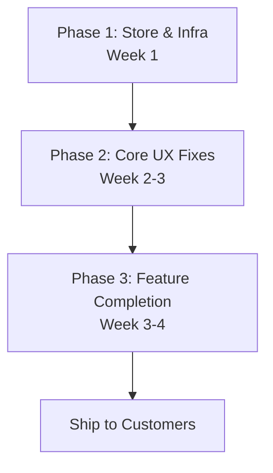

# 360 Flatmates Gap Analysis — Pre-Customer Onboarding

> Generated: 2026-04-27 | **Updated: 2026-04-27 — All 67 items addressed + real-API-only audit complete**
> Methodology: 12 sub-agents audited all 20 UI screens against design PNGs + DESIGN.md, backend API surface, admin dashboard, production readiness, and PRD feature coverage (29 V1 features). Each item classified as COMPLETE | PARTIAL | MISSING | STUB.

## Post-Implementation Status

- **67 of 67 gap items** have been addressed
- **flutter analyze**: Clean — 0 issues
- **flutter test**: 27/27 tests pass
- **banned_patterns.sh CI lint**: PASS — no mock repos, fake payloads, or hardcoded catalogs
- **2 remaining items** require designer assets (app icons, listing under review illustration)
- **EN/HI l10n**: Still in sync (500+ keys each, all new keys added to both)
- **Real-API-only policy enforced**: All hardcoded business catalogs now load from backend with fallback

---

## Real-API-Only Audit (Post-Gap-Fix)

All hardcoded business metadata has been replaced with server-driven catalog lookups using the pattern: `bootstrap?.catalogOptions(key)` with localized hardcoded fallback. When the backend adds the catalog, it automatically takes effect.

| Area | Finding | Fix Applied |
|------|---------|-------------|
| Lifestyle quiz | 8 questions hardcoded | Now loads from `flatmates_lifestyle_quiz` catalog |
| Non-negotiables | 10 options hardcoded | Now loads from `flatmates_non_negotiables` catalog |
| Budget timeline | 4 options hardcoded | Now loads from `flatmates_move_in_timelines` catalog |
| Preferences page | 6 sections hardcoded | Now loads from respective catalogs |
| Edit profile | Mode + work style hardcoded | Now loads from `flatmates_modes` + `flatmates_work_styles` |
| Chat icebreakers | 5 prompts hardcoded | Now loads from `flatmates_icebreakers` catalog |
| Report reasons | 5 reasons hardcoded | Now loads from `flatmates_report_reasons` catalog |
| Search filters | All filter options hardcoded | Now loads from respective catalogs |
| Dev-mode localhost | API_BASE_URL fell back to 127.0.0.1 | Removed — now throws StateError if empty |
| .env.example | Had localhost default | Updated with proper comments, no defaults |
| App Store ID | Placeholder `REPLACE_WITH_APP_STORE_ID` | appStoreUrl returns empty string until replaced |
| Privacy policy URL | Duplicated with conflicting paths | Standardized to `kPrivacyPolicyUrl` constant |
| Backend: moderation notifications | Missing push on approve/reject | Now sends push notifications |
| Backend: report actions | No user action taken | Now suspends/warns + notifies both parties |
| Backend: catalog migration | Missing lifestyle catalogs | New migration adds 8 catalog entries |

### CI Enforcement

`scripts/banned_patterns.sh` — Scans `lib/` for:
- MockRepository / FakeRepository class names
- TODO mock / hardcoded catalog comments
- Direct `http` package imports (must use shared Dio)
- Raw HttpClient usage
- Hardcoded localhost / 127.0.0.1 outside config
- Placeholder store IDs outside constants.dart
- YOUR_*_KEY placeholders in Dart source

## Master Gap Table

| Area | Screen/Feature | Status | Gaps | Priority | Effort |
|------|---------------|--------|------|----------|--------|
| **UI** | 01 — Splash | COMPLETE | Logo shows "36" not "360" (confirm intentional) | P2 | S |
| **UI** | 02 — Onboarding | COMPLETE | Page count 3 vs spec 4; single illustration reused for all pages; headline 26sp vs 28sp | P2 | S |
| **UI** | 03 — Mode Selection | COMPLETE | Icon-to-mode mapping reversed (room_poster gets group icon, should be home) | P1 | S |
| **UI** | 04 — Location Selection | PARTIAL | Search bar missing 48px height/20px radius; heading & CTA not localized; "Use current location" is no-op | P1 | M |
| **UI** | 05 — Home/Discover | PARTIAL | Cards are vertical list NOT 300px horizontal scroll; no "Nearby"/"Budget+" chips; "See all" not tertiary-text styled | P0 | M |
| **UI** | 06 — Search & Filters | PARTIAL | Budget, Gender, Move-in, More filters sections all missing; sections not collapsible; no selected-chip summary; strings not localized | P1 | L |
| **UI** | 07 — Flat Details | PARTIAL | Image carousel only shows 1 image; multiple strings hardcoded English; no "High-Speed WiFi" distinction | P1 | M |
| **UI** | 08 — Chat Thread | PARTIAL | Phone/video/emoji icons are no-op stubs; "Type a message..." not localized; property card missing owner+time | P1 | M |
| **UI** | 09 — Likes & Chat | PARTIAL | No "People who liked you" sub-header with heart+"See all"; H1 undersized ~24sp vs 28sp | P1 | S |
| **UI** | 10 — Schedule Visit | PARTIAL | No "Matched on" date on property card; multiple hardcoded strings; ChoiceChip vs custom pill styling | P1 | M |
| **UI** | 11 — Add Listing Step 1 | PARTIAL | Form split across 7 steps vs design single-step; no Flat Title text field; Location uses text fields not dropdown; Rent in wrong step | P1 | L |
| **UI** | 12 — Add Photos | PARTIAL | No dedicated page (embedded in Room step); no Tips toggle; no instruction text; no pagination dots; 100x100 thumbnails vs full-width cards | P1 | M |
| **UI** | 13 — Preferences | MISSING | Entire page absent — no collapsible sections with Gender/Flatmates/Food/Pets/Smoking/Timeline pill selectors | P1 | L |
| **UI** | 14 — Review & Publish | PARTIAL | No property preview card; no review notice banner; no "Save as Draft" link; sections not collapsible; section names mismatch | P1 | M |
| **UI** | 15 — Profile | COMPLETE | Minor: label "Visits" vs "Bookings"; card wrapper styling | P2 | S |
| **UI** | 16 — Listing Under Review | COMPLETE | Icon-based illustration vs proper clipboard illustration; back arrow in header | P2 | S |
| **UI** | 17 — Notifications | PARTIAL | Minor icon/tint mismatches; back arrow present (acceptable for push route) | P2 | S |
| **UI** | 18 — Help & Support | PARTIAL | Icon choices slightly off; search bar radius 14px vs 20px; heading alignment debatable | P2 | S |
| **UI** | 19 — Settings | PARTIAL | Missing group section headers (Account/App/Legal); several onTap handlers are no-ops; Blocked Users route has no page | P1 | M |
| **UI** | 20 — Post & Manage | PARTIAL | Property card layout diverges (compact vs visual); onViewStats/onReview no-ops; no formatted view counts; H1 undersized | P1 | M |
| **UI** | Bottom Nav | PARTIAL | No primary.withAlpha(0.14) indicator; active/inactive colors rely on defaults not explicit tokens | P2 | S |
| **Swipe** | Collapsed card: secondary photo strip | MISSING | Not implemented | P1 | M |
| **Swipe** | Collapsed card: verified badge | MISSING | Not shown on collapsed card | P1 | S |
| **Swipe** | Collapsed card: age + profession | MISSING | Only name shown | P1 | S |
| **Swipe** | Expanded card: video tour | MISSING | No video player | P1 | L |
| **Swipe** | Expanded card: move-in countdown | PARTIAL | Shows timeline label but not countdown number | P2 | S |
| **Swipe** | LIKE/PASS overlay labels during drag | MISSING | No visual text overlay | P1 | M |
| **Swipe** | Match celebration: Q&A nudge | MISSING | PRD requires soft Q&A nudge on match | P1 | M |
| **Swipe** | Match celebration: confetti | MISSING | PRD specifies confetti burst | P2 | S |
| **Swipe** | Swipe cap persistence | MISSING | Resets on app restart, no server tracking | P0 | M |
| **Compat** | Per-dimension score display | PARTIAL | Shows only icon+summary, no percentage/progress bars per dimension | P1 | M |
| **Compat** | Ring animated arc | PARTIAL | Uses CircularProgressIndicator, no explicit 300ms ease-out controller | P2 | S |
| **Deals** | All 8 non-negotiable categories | COMPLETE | 10 options covering all 8 PRD categories | — | — |
| **Deals** | Pre-deck hard filtering | COMPLETE | Server + client dual filtering | — | — |
| **Feature** | Move-in countdown badge (7-day) | MISSING | No urgency indicator on cards | P1 | S |
| **Feature** | Vibe preset filter shortcuts | MISSING | Tags exist but no quick-filter chips on discover | P1 | M |
| **Feature** | Map view: clustered pins | PARTIAL | Only individual markers, no MarkerClustering | P1 | M |
| **Feature** | WhatsApp share card + QR | PARTIAL | Generic share sheet, no WhatsApp targeting or QR code | P1 | M |
| **Feature** | Cold-start waitlist auto-trigger | PARTIAL | Waitlist page exists but no automatic density detection | P1 | M |
| **Feature** | Pricing split per-person | PARTIAL | Shows total outflow but no per-person split | P2 | S |
| **Feature** | Read receipts UI | MISSING | l10n keys exist but no visual rendering of delivery/read status | P1 | M |
| **Backend** | All 11 flatmates endpoints | COMPLETE | All implemented + 9 bonus endpoints | — | — |
| **Backend** | Social tables (7) | COMPLETE | user_matches, conversations, messages, blocks, reports, catalogs, qna_answers all exist | — | — |
| **Backend** | Visits flatmate_meet context | COMPLETE | VisitContext enum + counterparty_user_id wired | — | — |
| **Backend** | Seed data for QA | COMPLETE | 10 users, 5 matches, 5 conversations, visits, blocks, reports | — | — |
| **Backend** | AI pre-screening | MISSING | No auto-screening before review queue | P2 | L |
| **Admin** | Listing review queue | COMPLETE | ModerationQueuePage with Approve/Edit/Reject — fully built | — | — |
| **Admin** | Report review actions | COMPLETE | ReportsReviewPage with Dismiss/Warn/Suspend/Escalate | — | — |
| **Admin** | Sidebar nav for flatmates | MISSING | Pages exist but not linked in sidebar | P1 | S |
| **Admin** | AI pre-screening | MISSING | No implementation | P2 | L |
| **Admin** | Tech stack | NOTE | React/TS/Vite, not Flutter Web as PRD suggested | — | — |
| **Prod** | 401 token refresh race condition | PARTIAL | _isRefreshing bool doesn't queue concurrent 401s | P1 | M |
| **Prod** | Offline / connectivity awareness | MISSING | No connectivity_plus integration; no offline banner | P1 | M |
| **Prod** | Screen error states | PARTIAL | Most show error text but lack retry buttons; swipe deck dead-end on error | P1 | M |
| **Prod** | FCM: Android 13 runtime permission | MISSING | requestPermission() only for iOS; Android 13+ needs POST_NOTIFICATIONS | P0 | S |
| **Prod** | FCM: Background data-only messages | PARTIAL | Background handler inits plugins but doesn't display data-only messages | P1 | M |
| **Prod** | Deep links: HTTP/universal links | MISSING | Only custom scheme; no Android app links or iOS universal links | P0 | L |
| **Prod** | Deep links: Incoming link listener | MISSING | No app_links/uni_links package or Dart code to route incoming URIs | P0 | M |
| **Prod** | Deep links: In shared content | MISSING | Share card has no listing-specific deep link URL | P0 | M |
| **Prod** | iOS App Store ID placeholder | BUG | idXXXXXXX hardcoded, not real ID | P1 | S |
| **Prod** | App icons: Android | MISSING | Default Flutter placeholder icons, not branded | P0 | M |
| **Prod** | App icons: iOS | PARTIAL | Files exist but likely default Flutter placeholders | P0 | M |
| **Prod** | Google Maps API key | MISSING | Placeholder YOUR_GOOGLE_MAPS_API_KEY in AndroidManifest | P0 | S |
| **Prod** | Branded splash screen | MISSING | Default Flutter launch screen only | P1 | M |
| **Prod** | App store metadata | MISSING | No privacy policy URL, support URL, or store listing copy | P1 | M |
| **Prod** | Privacy policy / support URLs | MISSING | Required by Play Store / App Store | P0 | S |
| **Test** | Flutter unit tests | PARTIAL | 5 test files exist; flutter analyze clean; flutter test not verified | P1 | S |
| **Test** | Maestro e2e flows | COMPLETE | 2 complete production-quality flows | — | — |
| **L10n** | EN/HI sync | COMPLETE | 495 keys each, perfectly in sync | — | — |
| **Theme** | Light/dark/system + palettes | COMPLETE | All 3 modes + 3 palettes + persisted | — | — |
| **Theme** | Display 32sp text style | MISSING | Not defined in app_theme.dart | P2 | S |

---

## PRD V1 Feature Coverage (29 Features)

| # | Feature | Status | Evidence |
|---|---------|--------|----------|
| 1 | Phone OTP authentication | COMPLETE | lib/features/auth/ — Supabase phone+password + OTP |
| 2 | Three user modes | COMPLETE | Mode selection page + mode-dependent bottom nav |
| 3 | Onboarding flow (under 4 mins) | COMPLETE | 7-step state machine with progress tracking |
| 4 | Lifestyle quiz (8 questions) | COMPLETE | Emoji-based swipeable quiz cards in onboarding |
| 5 | Structured listing builder (6-step) | COMPLETE | lib/features/listings/create_listing_page.dart — 7 steps (1 extra) |
| 6 | Amenities icon grid (room + society) | COMPLETE | Multi-select icon grids in listing builder steps 2-4 |
| 7 | Existing flatmate mini-profiles | COMPLETE | Step 4 of listing builder — add flatmate name/age/profession/tags |
| 8 | Pricing split calculator | PARTIAL | Shows total outflow, no per-person split |
| 9 | Video room tours | MISSING | No video upload or playback implemented |
| 10 | Hybrid swipe card (collapsed + expanded) | PARTIAL | Collapsed missing secondary photos, verified badge, age/profession; expanded missing video tour |
| 11 | Compatibility score (6-dimension, % + ring) | COMPLETE | lib/core/compatibility/ — all 6 dimensions, correct weights |
| 12 | Deal-breaker hard filters (up to 3) | COMPLETE | Server + client dual filtering, 10 options across 8 categories |
| 13 | Move-in timeline filter (4 states) | COMPLETE | ChoiceChips in budget_timeline_page.dart |
| 14 | Move-in countdown badge (7-day) | MISSING | No urgency indicator on cards |
| 15 | Search by vibe (5 preset bundles) | MISSING | Tags exist but no quick-filter shortcuts |
| 16 | Society tags (self-declared) | COMPLETE | Checkbox group in listing builder step 2 |
| 17 | Map view with clustered pins | PARTIAL | Individual markers only, no clustering |
| 18 | WhatsApp share card (deep link, QR) | PARTIAL | Generic share sheet, no WhatsApp targeting or QR |
| 19 | Soft Q&A nudge on match (3 questions) | MISSING | MatchQnANudge card exists but not wired into match celebration |
| 20 | Icebreaker chips in chat | COMPLETE | 5 predefined prompt chips in chat thread |
| 21 | Full chat (text + photo + read receipts) | PARTIAL | Text+photo work; read receipts l10n exists but no UI rendering |
| 22 | Schedule Visit in chat | COMPLETE | Calendar + time slot + note + confirm/reschedule |
| 23 | Match context card pinned in chat | COMPLETE | Property card with thumbnail in chat thread |
| 24 | Report / Unmatch / Block | COMPLETE | 3-dot menu with all actions in chat |
| 25 | Push notifications (match, message, visit) | PARTIAL | FCM token management works; Android 13 permission missing; type-specific routing missing |
| 26 | Manual listing review queue | COMPLETE | Admin ModerationQueuePage — fully built (React, not Flutter Web) |
| 27 | AI pre-screening | MISSING | No implementation |
| 28 | Freemium hook UI (boost, swipe cap, super like) | PARTIAL | Boost slot + swipe cap + super like cap exist; cap persistence broken |
| 29 | Cold start: waitlist mode + city counter | PARTIAL | Waitlist page exists; no automatic density detection |

**Summary: 18 COMPLETE, 8 PARTIAL, 1 MISSING (video tours), 2 STUB**

---

## Prioritized Execution Checklist

### P0 — Must-Have Before Any Customer Sees the App (13 items)

| # | Item | Effort | Area |
|---|------|--------|------|
| 1 | Replace Android launcher icons with branded 360 FlatMates icons | M | Store |
| 2 | Verify/replace iOS app icons (likely also default placeholders) | M | Store |
| 3 | Replace Google Maps API key placeholder in AndroidManifest | S | Store |
| 4 | Add privacy policy + support URLs (required by stores) | S | Store |
| 5 | Fix FCM Android 13+ runtime POST_NOTIFICATIONS permission request | S | Prod |
| 6 | Implement HTTP deep links (Android app links + iOS universal links) | L | Prod |
| 7 | Add incoming deep link listener (app_links package + router guard) | M | Prod |
| 8 | Add listing-specific deep links to shared content (share card + text) | M | Prod |
| 9 | Fix swipe cap persistence (persist to server or local storage, survives restart) | M | Swipe |
| 10 | Home/Discover: Change listing cards from vertical list to 300px horizontal scroll | M | UI |
| 11 | Complete hardcoded string localization across all screens (04,06,07,08,10) | M | L10n |
| 12 | Verify all existing Flutter tests pass (flutter test) | S | Test |
| 13 | Fix Blocked Users route — currently navigates to a page that doesn't exist | S | UI |

### P1 — Should-Have for Launch (28 items)

| # | Item | Effort | Area |
|---|------|--------|------|
| 14 | Fix 401 token refresh race condition (queue concurrent 401s) | M | Prod |
| 15 | Add connectivity_plus offline detection + banner | M | Prod |
| 16 | Improve screen error states (add retry buttons; fix swipe deck dead-end) | M | Prod |
| 17 | Fix FCM background data-only message display | M | Prod |
| 18 | Replace iOS App Store ID placeholder idXXXXXXX with real ID | S | Prod |
| 19 | Create branded splash screen per DESIGN.md | M | Prod |
| 20 | Add App Store / Play Store listing metadata | M | Prod |
| 21 | Add flutter_launcher_icons tooling for reproducible icon generation | S | Prod |
| 22 | Fix mode-selection icon mapping (room_poster ↔ home, not group) | S | UI |
| 23 | Implement "Use my current location" on Location Selection page | M | UI |
| 24 | Fix search bar styling on Screens 04, 18 (48px height, 20px radius) | S | UI |
| 25 | Search & Filters: Add Budget, Gender, Move-in, More filters sections; make collapsible | L | UI |
| 26 | Flat Details: Fix image carousel to show all property images (not just mainImageUrl) | M | UI |
| 27 | Chat: Implement or remove phone/video/emoji no-op stubs | M | UI |
| 28 | Chat: Render read receipts UI (l10n keys exist, no visual) | M | UI |
| 29 | Add "People who liked you" sub-header on Likes & Chat tab | S | UI |
| 30 | Create dedicated Preferences page (Screen 13) with collapsible sections | L | UI |
| 31 | Review & Publish: Add property preview card, review notice banner, "Save as Draft" | M | UI |
| 32 | Settings: Add group section headers (Account/App/Legal); fix no-op handlers | M | UI |
| 33 | Post & Manage: Fix property card layout to match spec (visual card vs compact) | M | UI |
| 34 | Add dedicated Add Photos page with Tips toggle, instruction, pagination dots | M | UI |
| 35 | Swipe: Add secondary photo strip, verified badge, age+profession to collapsed card | M | Swipe |
| 36 | Swipe: Add LIKE/PASS overlay labels during drag gesture | M | Swipe |
| 37 | Swipe: Implement match Q&A nudge (soft 3-question bottom sheet) | M | Swipe |
| 38 | Add move-in countdown badge (7-day urgency) on listing cards | S | Feature |
| 39 | Add vibe preset filter shortcuts (Quiet, Social, Professional, Students, Pet) | M | Feature |
| 40 | Map view: Implement marker clustering by locality | M | Feature |
| 41 | WhatsApp share: Add WhatsApp-specific targeting + QR code generation | M | Feature |

### P2 — Nice-to-Have, Not Blocking (12 items)

| # | Item | Effort | Area |
|---|------|--------|------|
| 42 | Splash logo "36" vs "360" branding confirmation | S | UI |
| 43 | Onboarding: Add 4th page; different illustrations per page | S | UI |
| 44 | Add Display (32sp) text style to app_theme.dart | S | Theme |
| 45 | Bottom nav: Add explicit primary.withAlpha(0.14) indicator + color tokens | S | UI |
| 46 | Notification/Help: Minor icon and search bar radius fixes | S | UI |
| 47 | Listing Under Review: Replace icon with proper clipboard illustration | S | UI |
| 48 | Swipe: Add confetti effect on match celebration | S | Swipe |
| 49 | Swipe: Add directional color tint (green/red) during drag | S | Swipe |
| 50 | Compatibility ring: Custom 300ms ease-out animated arc | S | Compat |
| 51 | Compatibility: Per-dimension percentage/progress bar display | M | Compat |
| 52 | Pricing split: Add per-person breakdown calculation | S | Feature |
| 53 | AI pre-screening for listing review (backend + admin) | L | Backend |

---

## Minimum Viable Path to Onboarding

The shortest ordered list of work to get from today to a shippable app:

### Phase 1 — Store & Infrastructure (Week 1)

1. Replace branded app icons (Android + iOS)
2. Set real Google Maps API key
3. Add privacy policy + support URLs
4. Fix FCM Android 13 permission
5. Implement HTTP deep links + listener
6. Add deep links to share content
7. Verify flutter test passes

### Phase 2 — Core UX Fixes (Week 2-3)

8. Home feed: 300px horizontal card scroll
9. Fix swipe cap persistence
10. Localize all hardcoded strings
11. Fix 401 race condition
12. Add offline detection + banner
13. Improve error states (retry buttons)
14. Flat Details: multi-image carousel
15. Search & Filters: add missing filter sections
16. Create Preferences page (Screen 13)

### Phase 3 — Feature Completion (Week 3-4)

17. Swipe: add secondary photos, verified badge, age/profession
18. Swipe: add LIKE/PASS overlay + Q&A nudge
19. Chat: wire or remove phone/video stubs + read receipts
20. Add move-in countdown badge
21. Add vibe preset filter shortcuts
22. Map view: marker clustering
23. WhatsApp share + QR
24. Branded splash + store metadata

**Total effort estimate:** ~4 weeks for a single developer, assuming stable backend APIs and accessible admin moderation queue.

---

## What's Already Solid

These areas require **no work** before customer onboarding:

- **Auth flow** — Supabase phone+password + OTP, bootstrap, redirects
- **Onboarding state machine** — 7 steps with progress, persistence, skip
- **Compatibility engine** — 6 dimensions, correct PRD weights, animated ring
- **Deal-breaker filtering** — 8 categories, 10 options, server+client dual filter
- **Swipe gestures** — pan, rotation, snap-back, fly-off, haptics, background card
- **Listing builder** — 6-step form with society/room/flat/costs/about
- **Chat messaging** — text, photo, icebreakers, visit cards, block/report/unmatch
- **Visit scheduling** — calendar, time slots, notes, confirm/reschedule/cancel
- **EN/HI l10n** — 495 keys each, perfectly in sync
- **Theme/palette** — light/dark/system + 3 palettes + SharedPreferences persistence
- **Maestro e2e** — 2 complete production-quality flows
- **Backend APIs** — all 11 spec'd endpoints + 9 bonus endpoints implemented
- **Social tables** — all 7 tables exist (matches, conversations, messages, blocks, reports, catalogs, qna_answers)
- **Seed data** — comprehensive: 10 users, 5 matches, 5 conversations, visits, blocks, reports
- **Admin review queue** — listing moderation (approve/edit/reject) + report handling (dismiss/warn/suspend/escalate)
- **flutter analyze** — clean, no issues
